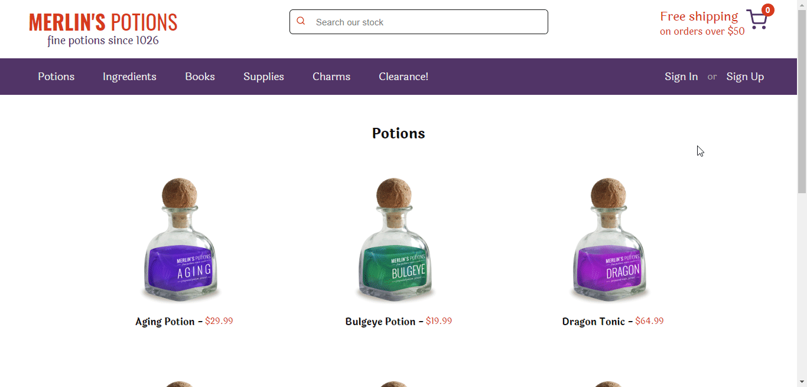

<h1 align="center">Merlin's Potions</h1>

Frontend project built with react

  

---

## :computer: Built With
- [ReactJS](https://pt-br.reactjs.org/)
- [Redux](https://redux.js.org/)

## :arrow_forward: Getting Started
You need the following tools installed in order to run this project: [Git](https://git-scm.com/) and [Node.js](https://nodejs.org/en/).

1. Clone this repository by running:   `git clone https://github.com/caiquegiovannini/mystic-shop.git`;
2. Enter the folder running through the terminal:   `cd mystic-shop`;
3. Run `npm install` to install the project dependencies;
4. Run `npm start` to start the development server;
5. Open [http://localhost:3000](http://localhost:3000) to view it in the browser.

## :bookmark_tabs: Specifications
This project was built with the following specifications:

- HTML written in the most semantic way possible;
- responsive and good looking layout;
- use of `yarn` dependency manager;
- BEM CSS methodology;
- React framework;
- consuming fake potions.json API data;
- use of redux to manage shared states.